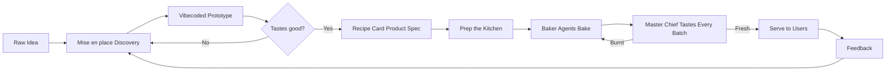
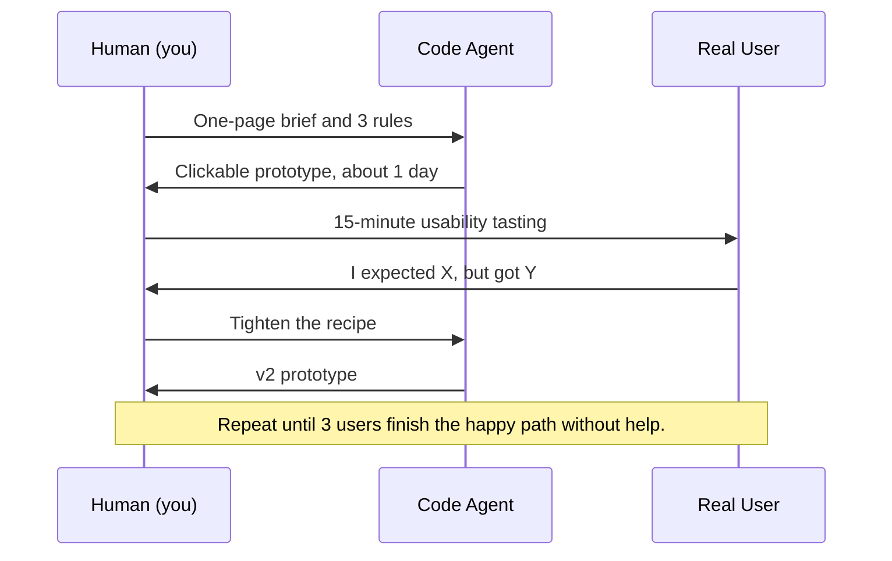
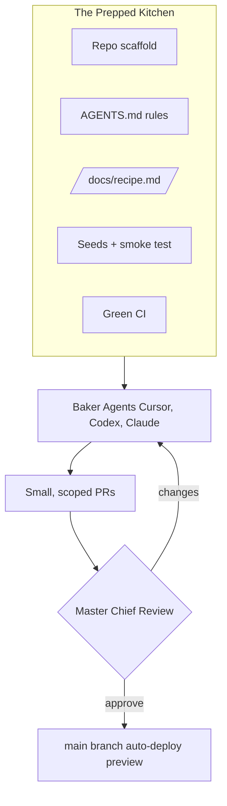
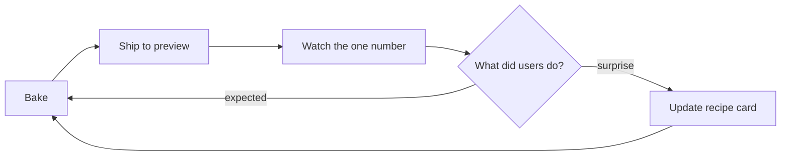

# How to turn an idea into a product recipe

*Category Product Design. Read time about 7 minutes. Series Recipes from the Softbake kitchen.*

A practical recipe for shaping a product idea into screens, flows, and a working prototype before the first line of real code is written, in a way that baker agents can actually pick up and run with.

## The bakery promise

Most software dies as a Notion page. It never makes it out of the bowl.

At [softbake.dev](https://softbakedev.github.io) we treat every product like a pastry. An idea is just flour and sugar until someone writes the recipe, weighs the ingredients, and pre-heats the oven. With code agents and a bit of vibecoding we can taste the cake on day two instead of in month three, but only if the recipe is written for hands that have never been in our kitchen, including the hands of an agent.

This article walks through the seven moves we use at Softbake to turn a fuzzy idea into a product recipe a baker agent can bake without burning.

## Why most ideas never make it into the oven

A founder pitches you an AI app for X, and three things usually happen. The team jumps straight to a Jira board and a stack decision. Two weeks later, nobody on the team can describe what the user does in their first sixty seconds. By the time something actually works, the idea has drifted three times and the budget is already gone.

The cause is almost always the same. We started baking before we wrote the recipe.

Modern code agents amplify this problem instead of solving it. Hand a vague prompt to Cursor, Codex, or Claude Code and you get something that looks like progress. A slick screen, a half-wired API, a database schema nobody asked for. It feels productive but it is not. It is dough without a shape.

A good product recipe fixes this by answering five questions before the agents start mixing. Who is hungry. What are they actually craving. Why is everything they tried so far stale. How does the first slice look, feel, and behave. When is it fresh enough to leave the oven. Once those five answers are written down in plain language, the rest of the work becomes mostly mechanical.

## The shape of the recipe

Before we walk through each step, here is the whole flow on one page.

Seven steps and one loop. The trick is to keep each step short enough that the team keeps moving, and concrete enough that an agent can execute it without inventing the brief on the way.

## Step one. Mise en place, line up the ingredients

In a real kitchen, *mise en place* means everything is chopped, measured, and within arm's reach before you turn on the heat. In product work it means the same thing. Collect every ingredient before you write a single user story.

For each new idea we capture six ingredients on a single page, in plain English, in one sitting.

The first ingredient is the user, and we describe them in one sentence so vivid that anyone on the team can picture them. The second is the job to be done, the actual outcome the user is trying to reach when they sit down with our product. The third is the pain, which is the honest reason today's options leave them frustrated. The fourth is the signal, the one observable behaviour that tells us the product is working, like a first invoice sent within ninety seconds of signup. The fifth is the constraints, the rules of physics around this product, which often look like compliance, integrations, or budget. The sixth, and the one most teams forget, is the list of non-goals, the things we are deliberately not baking even though they would be tempting.

If you cannot fill in all six in one sitting, the idea is not ready for an agent yet. It is ready for a conversation. Go talk to two real users, then come back to the page.

The output of this step is not a backlog. It is one page of plain English that any human, designer, or agent can read in ninety seconds and re-explain in their own words. If that test fails, you keep editing the page until it passes.

## Step two. Taste before you bake, the vibecoded prototype

Here is where modern dev process diverges sharply from the old way.

In the old way you would write a long PRD, then wireframes, then a high fidelity Figma board, then ask engineering for an estimate, then build, and finally demo something in week eight. By that point the idea has already gone cold and the team is married to decisions nobody really debated.

The Softbake way is different. The one page brief becomes a vibecoded prototype in the browser within forty eight hours. Vibecoding sounds glib but the discipline behind it is real. We hand the one pager to a code agent, usually Cursor with a strong system prompt or a tool like v0 or Lovable for pure interface work, with three rules that we never break. Build only the happy path, with no auth, no edge cases, and no database, because local state is enough at this stage. Use real copy from the brief, never lorem ipsum, because the words are part of the product. Ship one screen at a time, where every screen must be clickable and demoable on its own.

The point is not to write production code. The point is to make the idea touchable so the team can taste it. A prototype you can click is worth ten Figma boards because clicking forces decisions that Figma quietly lets you dodge. What happens when the input is empty. What is the loading state. Where does the user go after success.

When three real users complete the happy path on their own, with no hand-holding, the prototype has graduated. At that point we throw the code away on purpose. Vibecoded prototypes are tuned for speed of learning, not for the constraints we will inherit later, like authentication, scale, or test coverage. Carrying that code forward poisons the real bake. We keep the screens, the copy, and the lessons, and we let the implementation go.

## Step three. Write the recipe card, the product spec

Now you have something most teams never have, an idea that has already been tasted by real users. It is time to write the recipe card a baker agent can actually follow.

A Softbake recipe card is a single Markdown document with a predictable shape, and we keep it in the repo at `/docs/recipe.md` so it lives next to the code it describes. The first section repeats the ingredients from the one pager so the agent never has to ask. The second section names the slice we are baking first, which is the single user journey the MVP must deliver, broken down into three to seven named screens with a one line purpose for each. The third section is the method, written as a numbered list so the agent can follow it in order. It covers authentication, the data model, the screen routes, and the third party integrations, with enough detail that the agent does not have to invent. The fourth section is the definition of fresh, which is the acceptance criteria that tell us when to stop baking. Things like the new user finishing the happy path in under a target number of seconds, every screen having loading and error and empty states, test coverage on the critical path crossing some threshold, and zero `TODO` comments in shipped code. The fifth section lists what is out of the oven for this batch, the explicit non-goals.

Two things make this document different from a classic PRD. It is executable, because an agent can read the method section and start scaffolding migrations and routes without a meeting. And it has a definition of fresh, so the agents and the master chief know exactly when the bake is done.

When the recipe card drifts from the code, the code drifts from the product. Reviewing one is reviewing the other.

## Step four. Prep the kitchen, set up the baker agents

Code agents are powerful but they are not psychic. A baker agent dropped into an empty repo will produce confident, plausible, and subtly wrong code. The fix is the same one any chef uses. Prep the station before you turn on the gas.

A prepped kitchen at Softbake means a few things working together. The repo is already scaffolded with the chosen stack, whether that is Next.js with Prisma and tRPC, or FastAPI with Postgres, or whatever the recipe demands. The agent rules are committed as `AGENTS.md` and `.cursor/rules/`, so the conventions, the things we never do, and the tone of the project are all in one place. The recipe card sits in `/docs/recipe.md` as the single source of truth for what the product is. Seeded fixtures and a smoke test let any branch be run with one command, so the agent can verify its own work. And continuous integration is green from commit zero, even if the only check is `pnpm typecheck`, because the moment CI goes red, agents start guessing.

The investment here looks like overhead. It is in fact the highest leverage hour you will spend on the whole project. A prepped kitchen is the difference between agents that ship and agents that hallucinate.

## Step five. The first bake, let the agents do the heavy lifting

With the kitchen prepped, the master chief breaks the recipe into bake sized tasks. Each task is small enough for a single agent to finish in a single pull request, ideally in under an hour of agent time.

There are three rules we never break here. One agent works on one branch on one concern at a time, because parallel agents are great but tangled agents are a fire. Every pull request carries a checklist tied directly to the definition of fresh on the recipe card, so the agent has a target it can verify against. Tests live in the same pull request as the code they cover, because the words "we will add tests later" are how technical debt sneaks in.

A typical bake sized task reads more like a recipe than a ticket. It names the screen we are building, points at the relevant step on the recipe card, and lists the definition of fresh in checkbox form. It also says clearly what is out of scope for this task, so the agent does not wander into the next bake. The constraints are the gift. They let the agent fail fast and visibly instead of silently and grandly.

## Step six. The master chief tastes every batch

Automation gets you speed. Humans get you trust. Every pull request a baker agent opens passes through a human master chief who does four things, in this order.

First the chief re-reads the relevant slice of the recipe card to remember what done actually means for this batch, because it is easy to get pulled into the diff and forget the dish you were trying to cook. Then the chief runs the product, not just the code, clicking the buttons, breaking the form on purpose, and checking the empty and error states. Then the chief reviews the diff with one question in mind, which is whether they would be happy to maintain this code in twelve months. Finally the chief writes the verdict as a pull request review, and the verdict is one of three things. Approve. Request specific changes. Or re-bake the whole thing from scratch.

That last option deserves a moment of attention. Re-baking from scratch is a real, healthy, and often cheaper outcome than fixing a confused agent diff line by line. We are never precious about agent code. Throwing away two hundred lines and re-prompting with a sharper brief is part of the workflow, not a failure of it. This is the loop where vibecoding becomes engineering. The agents bring the speed, and the chief brings the taste.

## Step seven. Serving fresh, ship and listen and bake again

A pastry on the counter is not a product. A product is a pastry someone ate, came back for, and told a friend about. The last step is the one most teams quietly skip.

We deploy on a preview URL from pull request number one, not from version one point zero. We put the prototype in front of three real users in the first week, not in the third month. We wire one number to a dashboard, whether that is signups, invoices sent, or jobs completed, and we let that number tell us whether the recipe is working. And we schedule the next bake the moment the current one ships, because recipes are not static, and every batch teaches us what to change.

The loop never closes. It just gets shorter as the team learns the kitchen.

## Common burns to avoid

A few mistakes show up over and over again, in our work and in everyone else's. Skipping the one pager because the idea feels obvious is the most expensive shortcut in product, since obvious ideas turn out to be three different ideas in disguise. Letting the vibecoded prototype quietly become production code is another classic mistake, because a sketch is not a load bearing wall. Giving the agent a wall of paragraphs instead of structured headings and lists wastes tokens and trust, since agents read structure better than they read prose. Working without a definition of fresh leaves every pull request feeling almost done forever. Letting a single pull request grow to twenty changed files is usually a sign that the recipe was wrong, and the right move is to split it before merging. And reviewing only the diff, never the running app, is how teams ship code that compiles but does not work.

## The recipe card, condensed

Tear this off and stick it on the fridge.

> ### Recipe. Idea into Product
>
> **Ingredients**
>
> One user with a clear job to be done. One measurable signal of success. Two or three honest constraints. One short list of explicit non-goals.
>
> **Method**
>
> Start by writing the one pager in a single ninety minute sitting. Then vibecode a clickable prototype in a day or two, with code you are willing to throw away. Taste the prototype with three real users and iterate until they finish the happy path unaided. Write the recipe card into `/docs/recipe.md` so the agents and the chief share one source of truth. Prep the kitchen with a scaffold, an `AGENTS.md`, seed data, and a green CI pipeline. Slice the recipe into bake sized tasks, each with its own definition of fresh, and let the baker agents work one branch at a time. Have the master chief taste every batch, and re-bake without guilt when it is faster than fixing. Ship to a preview URL on day one, watch the one number that matters, and let the next bake start the moment the current one is out of the oven.
>
> **Bake until**
>
> The happy path runs end to end without help. Every screen has a loading, empty, and error state. The critical path is covered by tests. A real user finishes the journey unaided.
>
> **Serves** one working product, fresh in days rather than quarters.

## What is next in the series

This is the first recipe in the Softbake kitchen blog. The next one talks about how we plan a sprint kitchen for baker agents, and the one after that gets into what the master chief actually looks for when reviewing agent written code.

If you want us to bake your idea, the kitchen tour starts at [softbake.dev](https://softbakedev.github.io).

*Faster. Leaner. Always human checked.*
