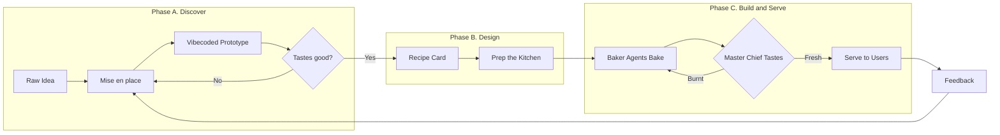
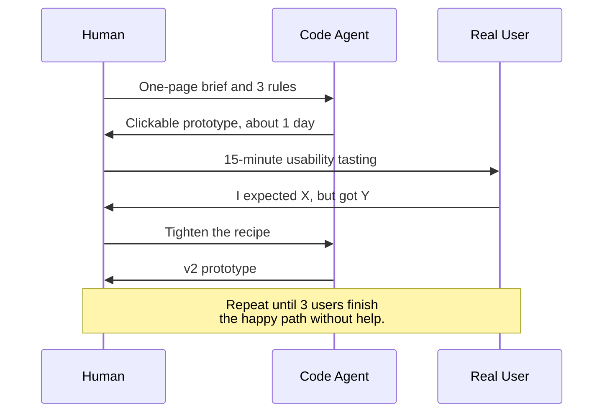
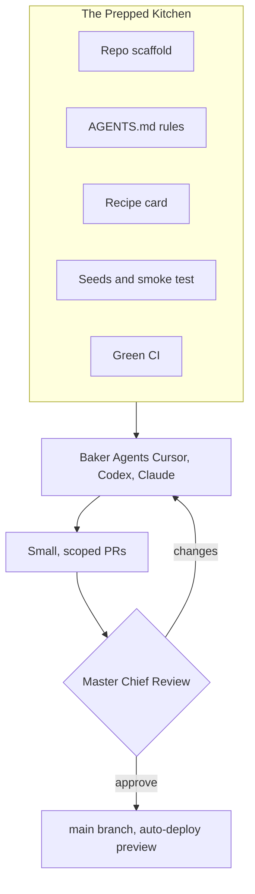
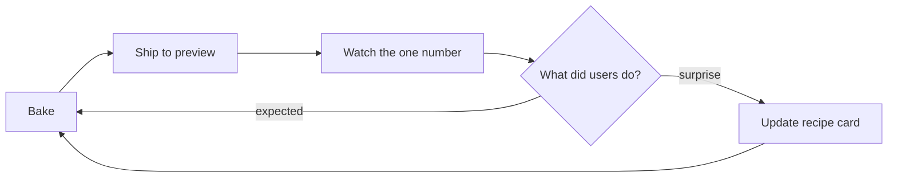

# How to turn an idea into a product recipe

*Part one of three in the Recipes from the Softbake kitchen series. Category Product Design. Read time about six minutes.*

## Who this is for

Founders shipping their first product, agency leads moving to agent assisted delivery, and CTOs piloting Cursor or Claude Code on a small team. If you have ever stared at a blank Jira board and wished there was a recipe to follow, this is the one we use at Softbake.

## On this page

1. [The bakery promise](#the-bakery-promise)
2. [Why most ideas never make it into the oven](#why-most-ideas-never-make-it-into-the-oven)
3. [The shape of the recipe](#the-shape-of-the-recipe)
4. [Phase A. Discover](#phase-a-discover)
    - [Step one. Mise en place](#step-one-mise-en-place-line-up-the-ingredients)
    - [Step two. Taste before you bake](#step-two-taste-before-you-bake-the-vibecoded-prototype)
5. [Phase B. Design](#phase-b-design)
    - [Step three. Write the recipe card](#step-three-write-the-recipe-card)
    - [Step four. Prep the kitchen](#step-four-prep-the-kitchen-set-up-the-baker-agents)
6. [Phase C. Build and serve](#phase-c-build-and-serve)
    - [Step five. The first bake](#step-five-the-first-bake-let-the-agents-do-the-heavy-lifting)
    - [Step six. The master chief tastes every batch](#step-six-the-master-chief-tastes-every-batch)
    - [Step seven. Serving fresh](#step-seven-serving-fresh-ship-and-listen-and-bake-again)
7. [Common burns to avoid](#common-burns-to-avoid)
8. [The recipe card, condensed](#the-recipe-card-condensed)

## The bakery promise

Most software dies as a Notion page. It never makes it out of the bowl.

At [softbake.dev](https://softbakedev.github.io) we treat every product like a pastry. An idea is just flour and sugar until someone writes the recipe and pre-heats the oven. With code agents and a bit of vibecoding we can taste the cake on day two instead of in month three, but only if the recipe is written for hands that have never been in our kitchen, including the hands of an agent.

This article walks through the seven moves we use to take an idea from a napkin sketch to something a client can actually taste.

## Why most ideas never make it into the oven

The team jumps straight to a Jira board. Two weeks later, nobody can describe what the user does in their first sixty seconds. By the time something works, the idea has drifted three times and the budget is gone. The cause is almost always the same. We started baking before we wrote the recipe.

Modern code agents amplify this. Hand a vague prompt to Cursor, Codex, or Claude Code and you get something that looks like progress, but it is dough without a shape. A good recipe fixes that by answering six small questions before the agents start mixing. Who is hungry. What are they craving. Why is everything they tried so far stale. How will we know the dish is working. What can we not do. What do we refuse to bake.

## The shape of the recipe

Here is the whole flow on one page, grouped into the three phases that organise the rest of the article.

Discover until the idea is real. Design until the recipe is concrete. Build and serve until the loop is short enough that you trust it.

## Phase A. Discover

Leave with an idea you have actually tasted, not one you have only described.

### Step one. Mise en place. Line up the ingredients

*Phase Discover. About 90 minutes. You need a real user, a piece of paper, and zero code.*

In a real kitchen, *mise en place* means everything is chopped and within arm's reach before the heat goes on. In product work it means the same thing. Collect every ingredient before you write a single user story.

We capture six ingredients on a single page. The user, in one sentence vivid enough that anyone can picture them. The job to be done, the outcome they are reaching for. The pain, the honest reason today's options leave them frustrated. The signal, the one observable behaviour that tells us the product is working. The constraints, often compliance, integrations, or budget. And the non-goals, the things we deliberately refuse to bake, which is the ingredient most teams forget.

If you cannot fill in all six in one sitting, the idea is not ready for an agent. It is ready for a conversation. Go talk to two real users, then come back. The output is one page anyone can read in ninety seconds and re-explain in their own words.

> **Kitchen note.** Non-goals are the most expensive ingredient to leave out. They stop scope creep before it has a name.

### Step two. Taste before you bake. The vibecoded prototype

*Phase Discover. One to two days. You need a code agent, a fast cheap model, and three real users on tap.*

The old way wrote a long PRD, wireframes, a high fidelity Figma board, an engineering estimate, then a build, then a demo in week eight. By then the idea has gone cold and the team is married to decisions nobody really debated.

The Softbake way turns the one pager into a vibecoded prototype in the browser within forty eight hours. We hand it to a code agent, usually Cursor or a tool like v0 or Lovable, with three rules we never break. Build only the happy path, no auth, no edge cases, no database. Use real copy from the brief, never lorem ipsum. Ship one screen at a time, each clickable on its own.

Model choice matters as much as tool choice. For the prototype we deliberately reach for cheap and fast models, because they keep up with the speed of thought and cost a fraction of what a top tier model would burn on the same screens. The savings buy more rounds of feedback, so by sundown the client is holding a polished clickable design instead of a Figma file that still has to be turned into something real.

| Phase | Model class | Examples | Why this class |
|---|---|---|---|
| Prototype | Cheap and fast | Cursor Composer, smaller frontier models | Speed of thought, throwaway code, many rounds in one day |
| Production code | Top tier reasoning | Claude Opus, GPT 5 thinking | Correctness, refactors, careful tests |
| Review and tests | Mid tier with strict prompt | Claude Sonnet, GPT 5 medium | Balance of cost and depth, good at structured checks |

The point is not production code. It is to make the idea touchable. A clickable prototype beats a Figma board because clicking forces decisions Figma lets you dodge. What happens on empty input. What is the loading state. Where does the user go after success.

When three real users finish the happy path on their own, the prototype has graduated. Then we throw the code away on purpose. Vibecoded code is tuned for speed of learning, not for the constraints we will inherit later, and carrying it forward poisons the real bake. We keep the screens, the copy, and the lessons.

> **Kitchen note.** When a user gets stuck, do not explain what to click. Watch in silence and write down what they tried. The silence is the data.

## Phase B. Design

Turn the lessons from the prototype into a brief a baker agent can execute without any hallway conversation.

### Step three. Write the recipe card

*Phase Design. About two hours of focused writing.*

Now you have something most teams never have, an idea already tasted by real users. Time to write the recipe card.

The recipe card is not really a file. It is the shape we use to describe the work, and it can live wherever the team already gathers, a Notion page, a shared document, a Markdown file in the repo, or a printed sheet on the wall. What matters is that the same shape is followed every time.

#### Ingredients

A clean copy of the six items from the one pager, so the card stays self contained as the brief travels.

#### The slice we are baking first

The single user journey the MVP must deliver, broken into three to seven named screens with a one line purpose each. More than seven is not a slice, it is a meal.

#### Method, written as a numbered list

The part the agent reads most often, written with the most discipline. Authentication, the data model, the screen routes, the integrations, with enough detail that an experienced engineer who has never seen the project could scaffold the first migration after one read.

#### Definition of fresh

The acceptance criteria that tell us when to stop. Without it, every pull request feels almost done forever.

| Product | Definition of fresh, in plain language |
|---|---|
| SaaS dashboard | New user finishes the happy path in under sixty seconds, every screen has loading and error and empty states, critical path is tested, no `TODO` comments shipped |
| Marketing site | Lighthouse above ninety on mobile, every page renders without JavaScript, copy reviewed by a human, contact form lands in our inbox |
| Internal CLI | Every command has help text, exit codes documented, happy path covered by integration tests, binary runs on a fresh machine with one install |

#### Out of the oven

The explicit non-goals, listed one more time at the end of the card, because that is the section the agent glances at when it is tempted to over-deliver.

Two things make this shape different from a classic PRD. It is executable, because an agent can start scaffolding without a meeting. And it has a definition of fresh. When the recipe card drifts from the code, the code drifts from the product.

> **Kitchen note.** Write the method as if the agent is a smart junior who has never seen your stack. Specific is kind. Vague is expensive.

### Step four. Prep the kitchen. Set up the baker agents

*Phase Design. One to two hours.*

Code agents are powerful but not psychic. Drop one into an empty repo and you get confident, plausible, subtly wrong code. The fix is the same one any chef uses. Prep the station before you turn on the gas.

A prepped kitchen has the repo already scaffolded with the chosen stack, the agent rules committed as `AGENTS.md` and `.cursor/rules/`, the recipe card somewhere everyone can reach, seeded fixtures and a smoke test that let any branch run with one command, and CI green from commit zero. The moment CI goes red, agents start guessing.

The investment looks like overhead. It is the highest leverage hour you will spend on the whole project. A prepped kitchen is the difference between agents that ship and agents that hallucinate.

> **Kitchen note.** Treat your `AGENTS.md` like a tasting menu, not a phone book. Five sharp rules an agent will follow beat fifty rules it will quietly ignore.

## Phase C. Build and serve

Keep the loop short enough that every batch teaches you something before the next one starts.

### Step five. The first bake. Let the agents do the heavy lifting

*Phase Build. Two to five days for a small MVP.*

The master chief breaks the recipe into bake sized tasks. Each one is small enough for a single agent to finish in a single pull request, ideally in under an hour of agent time.

Three rules we never break. One agent, one branch, one concern at a time, because parallel agents are great but tangled agents are a fire. Every pull request carries a checklist tied to the definition of fresh. Tests live in the same pull request as the code, because *we will add tests later* is how technical debt sneaks in.

A bake sized task reads more like a recipe than a ticket. It names the screen, points at the recipe card, lists the definition of fresh in checkbox form, and says what is out of scope. The constraints are the gift. They let the agent fail fast and visibly instead of silently and grandly.

> **Kitchen note.** If a task touches more than two folders, the recipe was wrong, not the agent. Split the task before you split the diff.

### Step six. The master chief tastes every batch

*Phase Build. About thirty minutes per pull request.*

Automation gets you speed. Humans get you trust. Every agent pull request passes through a human master chief who does four things, in order. Re-read the relevant slice of the recipe card. Run the product, not just the code, clicking the buttons and breaking the form on purpose. Review the diff with one question in mind, whether they would be happy to maintain this in twelve months. Write the verdict, which is approve, request specific changes, or re-bake from scratch.

The chief also runs a small set of recurring checks agents tend to fumble. Are secrets read from the environment. Is anything sensitive logged. Do new forms have proper labels and keyboard focus. Does the screen stay usable on a phone. Is there an error state for the network calls. None of these take long, but missing them is how agent code earns the reputation of being sloppy.

Re-bake from scratch is often cheaper than fixing a confused diff line by line. Throwing away two hundred lines and re-prompting is part of the workflow, not a failure of it. The agents bring the speed, the chief brings the taste.

> **Kitchen note.** Run the app on your phone before you approve. Half of the bugs that ship hide on the small screen.

### Step seven. Serving fresh. Ship and listen and bake again

*Phase Serve. Ongoing, starting on day one.*

A pastry on the counter is not a product. A product is a pastry someone ate, came back for, and told a friend about.

We deploy on a preview URL from pull request number one. We put the prototype in front of three real users in the first week. We wire one number to a dashboard, signups, invoices sent, jobs completed, and let it tell us whether the recipe is working. We schedule the next bake the moment the current one ships.

The loop never closes. It just gets shorter as the team learns the kitchen.

> **Kitchen note.** Pick a number you would tell your client about over coffee, not one that needs a dashboard to explain.

## Common burns to avoid

Six mistakes show up so often they have earned their own names.

> **The obvious idea trap.** Skipping the one pager because the idea feels too simple to need it. Obvious ideas almost always turn out to be three different ideas in disguise.

> **The promoted prototype.** Letting the vibecoded prototype quietly become the production codebase. A sketch is not a load bearing wall.

> **The wall of words prompt.** Giving the agent a long paragraph instead of structured headings and lists. Agents read structure better than prose.

> **The forever almost done pull request.** Working without a definition of fresh. Every pull request feels ninety percent done, and the last ten percent never converges.

> **The mega pull request.** Letting a single pull request grow to twenty changed files. The bake sized task was not bake sized at all.

> **The diff only review.** Reviewing only the patch, never the running app. Code that compiles is not code that works.

## The recipe card, condensed

Tear this off and stick it on the fridge.

> ### Recipe. Idea into Product
>
> **Ingredients**
>
> One user with a clear job to be done. One measurable signal of success. Two or three honest constraints. One short list of explicit non-goals.
>
> **Method**
>
> Write the one pager in one ninety minute sitting. Vibecode a clickable prototype with a fast cheap model and throw the code away. Taste it with three real users until they finish the happy path unaided. Write the recipe card somewhere everyone can reach. Prep the kitchen with a scaffold, an honest `AGENTS.md`, seed data, and green CI. Slice the recipe into bake sized tasks with their own definitions of fresh, and let the baker agents work one branch at a time. The master chief tastes every batch, runs the security and accessibility checks, and re-bakes without guilt when it is faster than fixing. Ship to a preview URL on day one, watch the one number that matters, and start the next bake the moment the current one ships.
>
> **Bake until**
>
> The happy path runs end to end without help. Every screen has loading, empty, and error states. The critical path is tested. A real user finishes the journey unaided.
>
> **Serves** one working product, fresh in days rather than quarters.

## What is next in the series

Three more recipes are on the proofing tray.

*Planning a sprint kitchen for baker agents* covers what right planning looks like once agents do the heavy build work. How a recipe is sliced into bake sized tasks, how parallel agents are sequenced without stepping on each other, and how to keep the timeline honest when a job finishes in twenty minutes instead of two days.

*Body shopping versus agent shopping* compares the two delivery models. The traditional way rents developer bodies by the hour, paying for time and trusting the supplier to set the throughput. The Softbake way rents agent capacity orchestrated by a human master chief, paying for outcomes and scaling by adding parallel agents instead of heads. Side by side on cost, speed, accountability, and what happens when the project ends.

*Human quality checks for agent written code* is the long version of the master chief paragraph above, with the recurring checks the chief actually runs and the small habits that keep trust between humans and agents in good standing.

If you want us to bake your idea while you wait, the kitchen tour starts at [softbake.dev](https://softbakedev.github.io).

*Faster. Leaner. Always human checked.*
